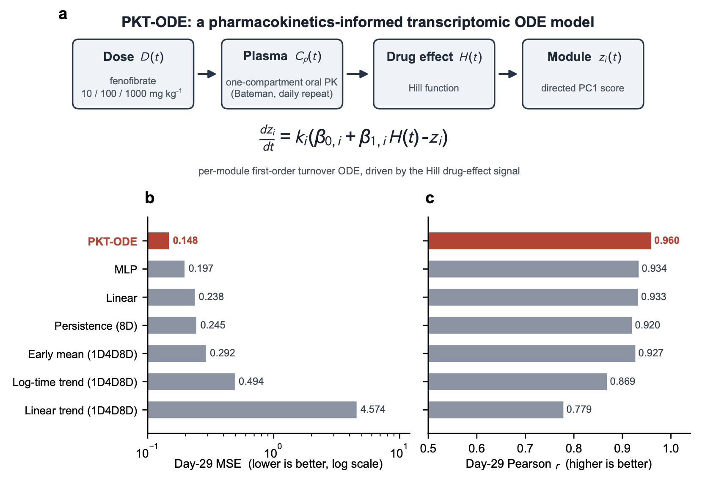

# PKT-ODE

Code and compact analysis data for **“A pharmacokinetics-informed ODE extrapolates long-term fenofibrate transcriptomic responses.”**

PKT-ODE links a once-daily oral pharmacokinetic profile to a Hill drug-effect signal and then to first-order turnover of transcriptomic co-expression modules. The publication analysis uses Open TG-GATEs rat-liver data for fenofibrate at 10, 100, and 1,000 mg/kg/day. Model fitting uses 54 replicate profiles through day 8; day 15 is held out as an intermediate endpoint and day 29 is the test endpoint.



## Evidence boundary

This repository supports a single-compound proof of concept:

- one compound: fenofibrate;
- one organ and species: rat liver;
- three once-daily oral dose levels;
- six fitting times from 3 hours through day 8;
- one intermediate held-out endpoint at day 15;
- one test endpoint at day 29.

It does **not** establish generalization across compounds, organs, species, dose schedules, or toxicity outcomes. The PPAR-alpha target analysis is a descriptive biological concordance check, not independent validation.

## Model

For a daily administered dose \(D\), the active-metabolite concentration is represented by superposition of one-compartment oral Bateman profiles. A Hill function converts concentration to a bounded effect signal:

\[
H(t)=\frac{C_p(t)^n}{EC_{50}^n+C_p(t)^n}.
\]

Each directed module PC1 score \(z_i(t)\) follows

\[
\frac{dz_i}{dt}=k_i\left[\beta_{0,i}+\beta_{1,i}H(t)-z_i(t)\right],
\qquad z_i(0)=\beta_{0,i}.
\]

The PK and Hill parameters are fixed from literature priors. The model estimates \(k_i\), \(\beta_{0,i}\), and \(\beta_{1,i}\) independently for each of seven modules, for 21 fitted parameters in total.

## Published result

At the held-out day-29 endpoint, the manuscript reports:

| Model | Day-29 MSE | Day-29 Pearson r |
|---|---:|---:|
| Linear trend | 4.574 | 0.779 |
| Log-time trend | 0.494 | 0.869 |
| Early mean | 0.292 | 0.927 |
| Persistence | 0.245 | 0.920 |
| Linear transition | 0.238 | 0.933 |
| MLP transition | 0.197 | 0.934 |
| **PKT-ODE** | **0.148** | **0.960** |

The PKT-ODE endpoint calculation flattens three doses, three biological replicates, and seven modules, giving 63 values per endpoint. Module values from the same animal and dose are not independent, so the metrics are descriptive. The machine-readable manuscript table is in [`data/processed/benchmark_metrics.tsv`](data/processed/benchmark_metrics.tsv).

The table reports the outputs of the publication analysis pipelines. PKT-ODE uses fit-window MAD-normalized replicate profiles (63 endpoint values), whereas the deterministic and learned comparators use standardized condition means (21 endpoint values). Their reported MSE values therefore reproduce the manuscript but do not have an identical normalization scale or observational unit.

## Repository contents

```text
PKT-ODE/
├── data/
│   ├── processed/                 # compact module trajectories and fitted parameters
│   └── reference/                 # literature-curated PPAR-alpha target snapshot
├── results/figures/               # figures used in the manuscript
├── src/
│   ├── cel_processing/            # Open TG-GATEs CEL/RMA/log2FC preprocessing
│   ├── gene_module_reduction/     # training-only selection, WGCNA, and fixed PC1 projection
│   ├── module_dynamics/           # statistical and learned comparator models
│   └── pkt_ode/                    # standalone PKT-ODE fitting and reproduction code
└── tests/                          # numerical and pipeline tests
```

The snapshot intentionally excludes unrelated experimental pipelines, raw CEL files, cluster launch scripts, local caches, working reports, and repository history.

## Installation

Python 3.10 or newer is recommended.

```bash
python3 -m venv .venv
source .venv/bin/activate
python3 -m pip install --upgrade pip
python3 -m pip install -e ".[test]"
```

WGCNA reconstruction additionally requires R 4.x and the packages listed in `requirements-wgcna.R`:

```bash
Rscript requirements-wgcna.R
```

## Reproduce the published-parameter simulation

This fast command re-simulates all three doses and seven modules from the published parameter table, then reports replicate-level training, validation, and test metrics:

```bash
python3 -m src.pkt_ode verify
```

The rounded published parameter table reproduces the manuscript result: day-29 MSE is approximately 0.148 and Pearson \(r\) is approximately 0.960 across 63 replicate-module observations.

Evaluate the four deterministic statistical baselines:

```bash
python3 -m src.pkt_ode baselines
```

Regenerate all four main figures into a separate output directory:

```bash
python3 -m src.pkt_ode figures
```

Generated files are written under `results/reproduced_figures/` and do not overwrite the manuscript figure snapshot.

## Refit PKT-ODE

The bundled PKT-ODE input is aligned and normalized by the fit-window module-wise MAD multiplied by 1.4826. It can be rebuilt from the frozen projection without raw CEL data:

```bash
python3 -m src.pkt_ode prepare-input
```

The following command performs the full seven-module, 12-start L-BFGS-B fit using only times through day 8:

```bash
python3 -m src.pkt_ode fit \
  --parameters-output results/reproduction/fitted_parameters.tsv \
  --metrics-output results/reproduction/fitted_metrics.tsv \
  --seed 42
```

The fitting entry point is intentionally separate from the fast published-parameter verification. Parameter differences at the last reported decimal can arise from optimizer and numerical-library versions.

## Comparator models

The compact reduction directory can be consumed directly by the statistical and learned residual-transition implementation:

```bash
REDUCTION_DIR=data/processed/fenofibrate_reduction

python3 -m src.module_dynamics.basic_rollout baseline \
  --reduction-dir "$REDUCTION_DIR" \
  --run-name reproduction

python3 -m src.module_dynamics.basic_rollout train \
  --reduction-dir "$REDUCTION_DIR" \
  --model linear \
  --dynamics observed \
  --conditioning none \
  --loss-mode mean \
  --device cpu \
  --run-name linear_reproduction

python3 -m src.module_dynamics.basic_rollout train \
  --reduction-dir "$REDUCTION_DIR" \
  --model mlp \
  --dynamics lrd \
  --conditioning residual_adapter \
  --loss-mode mean \
  --device cpu \
  --run-name mlp_reproduction
```

Learned configurations must be selected using day-15 MSE before reading day-29 test performance. See [`src/module_dynamics/README.md`](src/module_dynamics/README.md) for the split and rollout contracts.

## From raw Open TG-GATEs data

Raw CEL files are not redistributed in this repository. To rebuild the expression inputs:

1. Download the Open TG-GATEs in vivo rat data and metadata into `data/raw/`.
2. Obtain the Brainarray `Rat2302_Rn_ENSG` version 25 custom CDF.
3. Build and audit the sample manifest.
4. Run organ-wide RMA.
5. Compute matched-control log2 fold changes.
6. Run the single-compound selection, WGCNA, fixed-PC1 projection, and audit stages.

The entry points are:

```bash
python3 -m src.cel_processing.prepare_rma_samples --dry-run
Rscript src/cel_processing/rma_normalize.R --organ liver
python3 -m src.cel_processing.compute_log2fc --organ liver

python3 -m src.gene_module_reduction prepare \
  --organ liver --compound fenofibrate --run-name publication
python3 -m src.gene_module_reduction select \
  --organ liver --compound fenofibrate --run-name publication
python3 -m src.gene_module_reduction fit-wgcna \
  --organ liver --compound fenofibrate --run-name publication \
  --deep-split 4 --min-module-size 10 --merge-cut-height 0.05
python3 -m src.gene_module_reduction transform \
  --organ liver --compound fenofibrate --run-name publication \
  --deep-split 4 --min-module-size 10 --merge-cut-height 0.05
```

Detailed data contracts and eligibility rules are documented in the component READMEs. All examples use repository-relative, portable paths.

## Data provenance

The raw transcriptomic data are available from [Open TG-GATEs](https://dbarchive.biosciencedbc.jp/en/open-tggates/desc.html). The database is provided by the Toxicogenomics Project and Toxicogenomics Informatics Project under the Creative Commons Attribution-ShareAlike 2.1 Japan license.

The compact projection archive contains derived directed-PC1 module scores for 72 public transcriptome profiles: three doses by eight time points by three biological replicates. Gene selection, representation fitting, and PKT-ODE normalization use only the 54 profiles from the six time points through day 8. The day-15 and day-29 expression values are projected and normalized using frozen training quantities. The PKT-ODE-specific aligned archive preserves raw module scores, MAD and standard-deviation scales, regimen labels, sample identifiers, and fit-window flags.

## Testing

Run lightweight unit and integration tests with:

```bash
python3 -m pytest
```

The test suite checks data axes, numerical bounds, published-parameter re-simulation, statistical baselines, preprocessing utilities, WGCNA projection contracts, and comparator components. It does not download raw data or launch the final full fitting workflow.

## Citation

If you use this repository, cite the associated preprint:

> Gao Y, Zhang Z, Li Y, Qiu J. A pharmacokinetics-informed ODE extrapolates long-term fenofibrate transcriptomic responses. bioRxiv (2026).

## License

The software is released under the [MIT License](LICENSE). Derived Open TG-GATEs data remain subject to the source database's attribution and share-alike terms.
